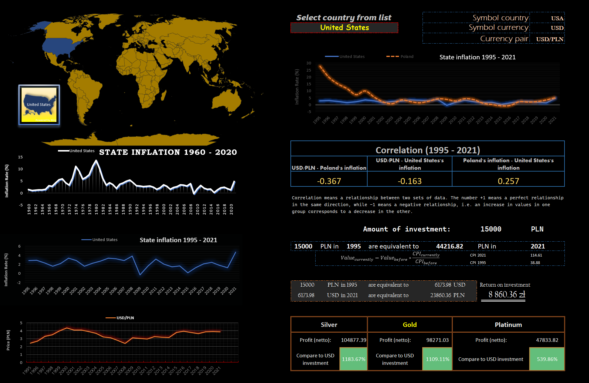

# Global inflation and investment

The excel file contains historical data on inflation in countries around the world. It allows you to select a country from a list and track the data since 1960. Some countries and time periods may be missing.
Below is the appearance of the control panel:

Inflation as measured by the consumer price index reflects the annual percentage change in the cost to the average consumer of acquiring a basket of goods and services that may be fixed or changed at specified intervals, such as annually. The Laspeyres formula is generally used.

Excel also determines the convergence to inflation in Poland. It provides information about the return on investment of Polish zlotys in the currency of the selected country since 1995. The data is approximate because it does not take into account the difference in buying and selling currencies, as well as taxes due. 

The excel function also calculates correlations (i.e., the dependence of the data on each other) with respect to currency, and inflation.

Data sources (accessed August 2022):

Inflation data:
https://data.worldbank.org/indicator/FP.CPI.TOTL.ZG

Exchange rates in 1984 - 2022
https://www.nbp.pl/homen.aspx?c=/ascx/ArchAen.ascx

CPI in Poland 1995 - 2021:
https://www.inflationtool.com/polish-zloty?amount=100&year1=2001&year2=2002&frequency=yearly

Historical prices of silver, gold and platinum:
https://stooq.pl/q/d/?s=xptpln&c=0&d1=19950101&d2=20211231&i=y
